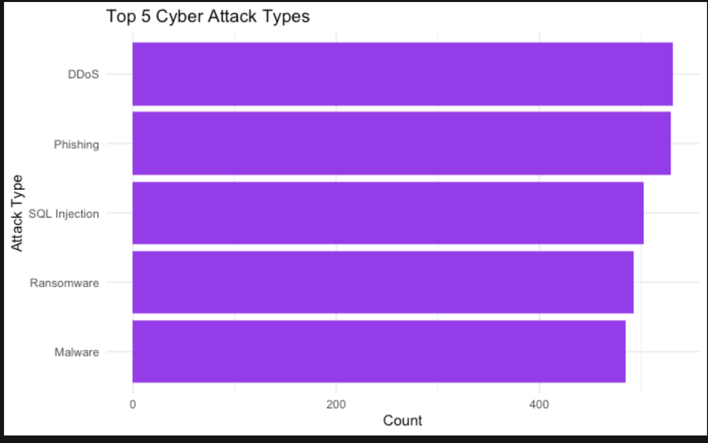
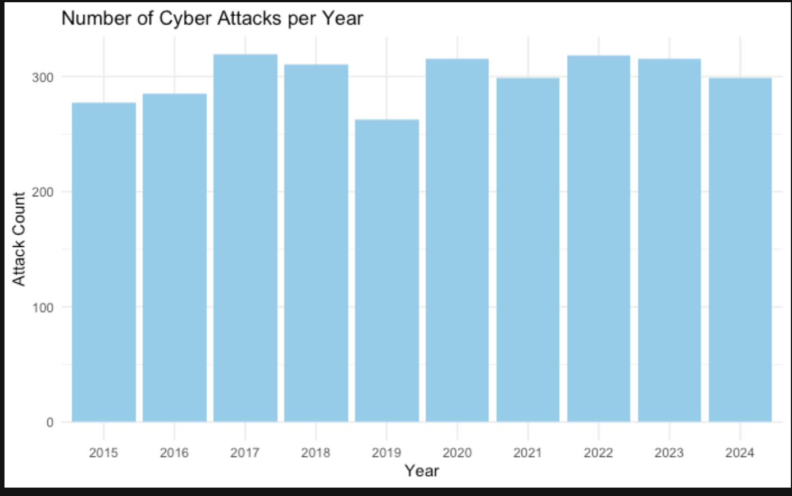

# 🔐 Global Cybersecurity Threats (2015–2024)

A data visualization project analyzing the rise in cyberattacks and the resulting financial losses over the past decade. Built using R, ggplot2, and Quarto.

## 📈 Project Highlights

- Top 5 most common cyberattack types
- Yearly trends in number of cyberattacks
- Visualization-ready Quarto report (`.qmd`)
- Clean plots with accessible color themes

## 📊 Visuals

### Top 5 Cyber Attack Types

### Number of Cyber Attacks per Year

## 🛠️ Tech Stack

- **Language:** R  
- **Data Wrangling:** dplyr  
- **Visualization:** ggplot2  
- **Report Generation:** Quarto

